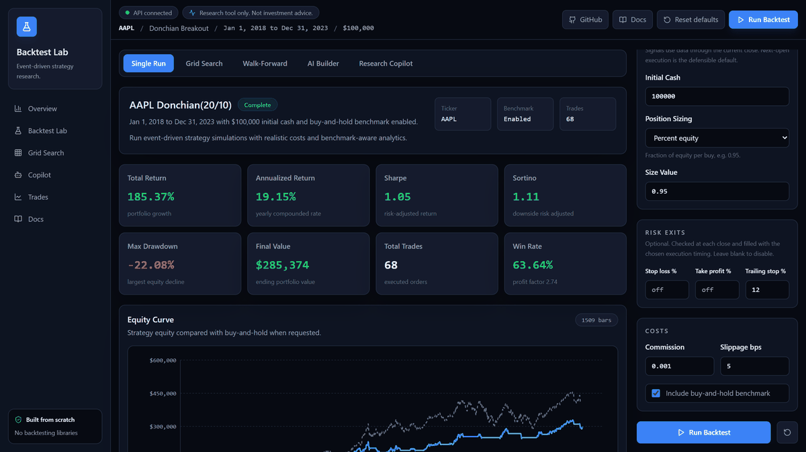
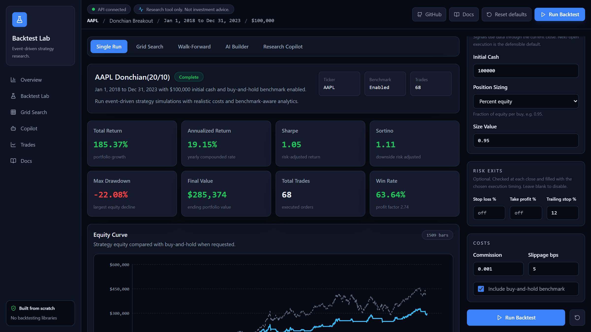
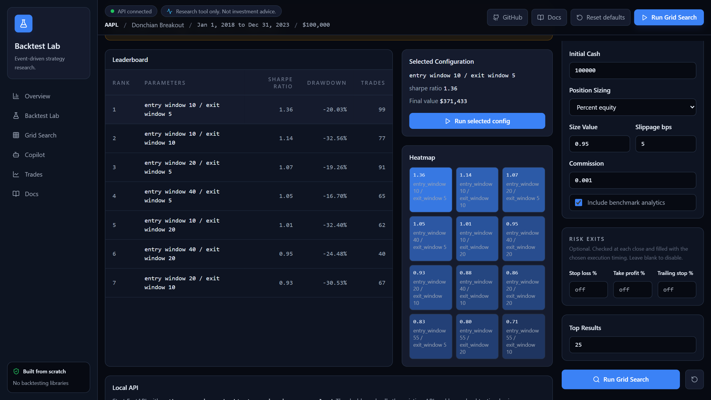
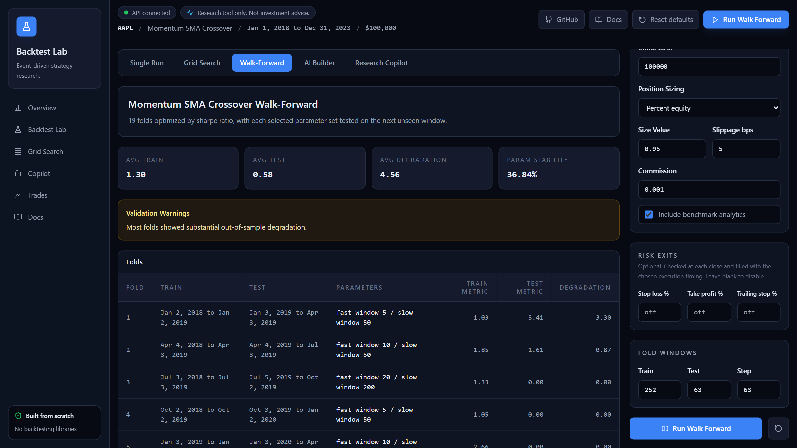
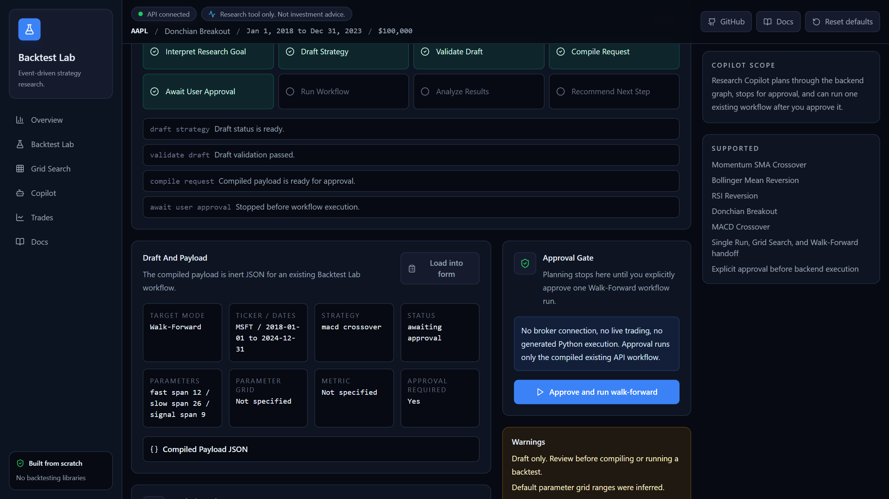
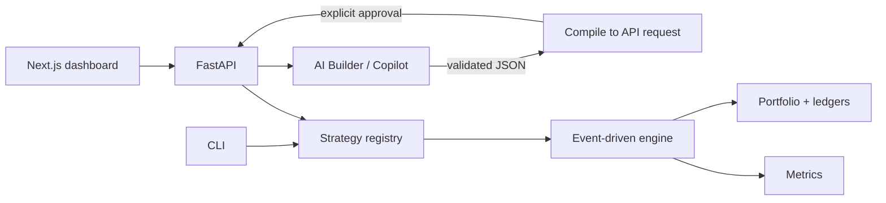

<div align="center">

# Backtest Lab AI

**A from-scratch, event-driven backtesting engine with a research dashboard and a guarded AI strategy assistant.**

[](https://github.com/codysj/AI-Backtest-Lab/actions/workflows/ci.yml)


[](LICENSE)



</div>

> [!NOTE]
> Research tool only. Not investment advice. There is no brokerage integration or order placement.

Backtest Lab turns a strategy idea into an auditable result. You can pick a built-in strategy or describe one in plain English. Then run it bar by bar, sweep its parameters, and check whether it holds up out of sample. Every number comes from a Python engine that uses no backtesting or quant-metrics libraries.

## What makes it different

**No look-ahead by construction.** Strategies decide at the close using a copy of history that ends at the current bar. Orders fill at the next open by default. Each run returns a linked ledger of decisions, orders, fills, and order events, so any trade can be traced to the data that caused it. See [the execution-timing decision](docs/decisions/2026-09-16-close-signal-next-open-execution.md).

**Research workflows that punish overfitting.** Grid search keeps failed combinations and flags fragile optima. Walk-forward validation picks parameters on a training window and scores them on the next unseen window. Test folds warm up indicators on prior data but only trade and score inside the test window.

**AI that cannot execute anything.** The AI Builder and Research Copilot turn prompts into JSON, never code. That output is validated against strict schemas and compiled into the same API requests a human would send. The Copilot stops at an approval gate, and the backend revalidates the approved payload before it runs. See [the rule DSL decision](docs/decisions/2026-05-07-ai-rule-dsl-no-generated-code.md).

## Capabilities

| Area | What is included |
| --- | --- |
| Strategies | SMA crossover, Bollinger mean reversion, RSI reversion, Donchian breakout, MACD crossover, and an AI-authored rule DSL |
| Rule DSL | close, SMA, EMA, RSI, prior rolling high/low, Bollinger bands, constants; `>` `<` `>=` `<=` `crosses_above` `crosses_below` |
| Execution | Next-open or same-close fills, commission, basis-point slippage, gap-aware cash clipping |
| Sizing | Fixed quantity, fixed dollar, all-in, percent of equity, volatility target |
| Risk exits | Stop-loss, take-profit, and trailing stop, evaluated at the close and recorded with a reason |
| Metrics | Total, annualized, and excess return; Sharpe, Sortino, information ratio, alpha/beta; drawdown and duration; VaR/CVaR; rolling metrics; trade stats |
| Research | Grid search with heatmaps and robustness warnings; walk-forward with degradation and parameter stability |
| Interfaces | Next.js dashboard, FastAPI, CLI, and a Python API including a multi-asset engine |

<table>
<tr>
<td></td>
<td></td>
</tr>
<tr>
<td></td>
<td></td>
</tr>
</table>

## Architecture



One strategy registry drives API validation, dashboard forms, CLI flags, research grids, and AI compilation, so adding a strategy is a one-file change. The frontend is a pure API client and implements no trading logic. Module-level detail lives in [docs/architecture.md](docs/architecture.md).

## Quick start

Requires Python 3.12+ and Node 20+.

```bash
python -m venv .venv
source .venv/bin/activate        # Windows: .venv\Scripts\activate
python -m pip install -r requirements.txt
python -m uvicorn backtester.api.main:app --reload
```

In a second terminal:

```bash
cd frontend
npm ci
npm run dev
```

Open http://localhost:3000. The AI features use a deterministic offline provider unless you configure one in `.env`, following [.env.example](.env.example). Market data comes from yfinance and is cached as Parquet under `~/.backtester/cache/`.

### CLI

```bash
python -m backtester.cli run --ticker AAPL --start 2018-01-01 --end 2023-12-31 \
  --strategy donchian_breakout --param entry_window=55 --trailing-stop 0.12 --benchmark
python -m backtester.cli grid-search --ticker AAPL --start 2018-01-01 --end 2023-12-31 \
  --strategy rsi_reversion --grid window=7,14,21
```

## Quality gates

CI runs all of these on every push and pull request.

```bash
python -m pytest                 # 234 tests on deterministic synthetic data
python -m mypy backtester        # strict mode
cd frontend && npm run lint && npm run typecheck && npm run build
cd frontend && npm audit --omit=dev --audit-level=high
```

Tests cover accounting, execution timing, causality of every registered strategy, risk exits, walk-forward warm-up, API contracts, AI validation, and approval-gate tampering.

## Limitations

- Daily bars only. Stops trigger on closes because daily data cannot say whether the high or the low printed first.
- The engine copies bounded history each bar, trading speed for a structural no-look-ahead guarantee. See [benchmark results](docs/benchmark_results.md).
- yfinance closes are split-adjusted but not dividend-adjusted, so strategy and benchmark returns exclude dividends.
- Multi-asset backtests exist in the Python engine but not in the API or dashboard yet.
- No persistence, authentication, or deployment configuration.

Planned work is in [docs/tasks.md](docs/tasks.md) and [docs/technical-roadmap.md](docs/technical-roadmap.md).

## License

[MIT](LICENSE)
